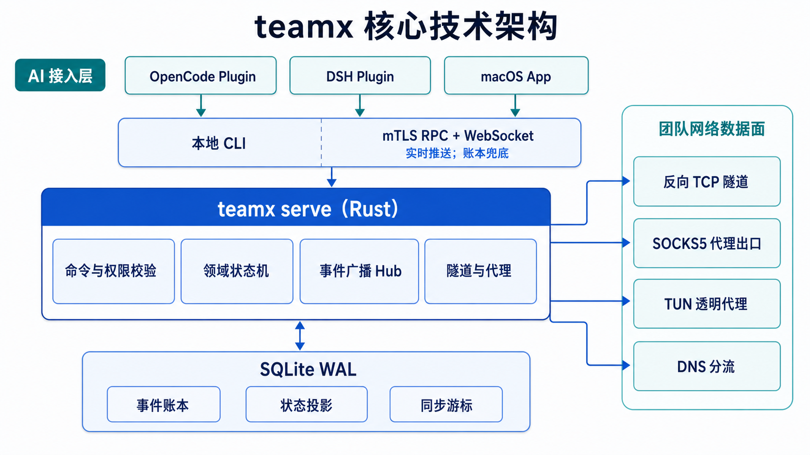

# teamx

> 三个臭裨将，顶个诸葛亮。
> *Three humble lieutenants can match one brilliant strategist.*

teamx is a **shared-goal team collaboration** tool for [opencode](https://github.com/opencode-ai/opencode), built for **AI-native organizations**. Humans in the loop.

Its founding belief: **an ordinary model, multiplied by collaboration, can outperform a single brilliant model working alone.** teamx organizes multiple independent opencode sessions into a team with division of labor, a shared goal, and a working rhythm — so a team of free opencode LLMs can match, or even exceed, what an expensive commercial LLM does alone.

The owner shares one goal with the team, and every member works toward it — often in their own way, on their own implementation.

This is different from the common "multi-agent" model. Instead of decomposing a task into subtasks and handing each to an isolated agent, teamx keeps **humans in the loop** and embraces a **shared-goal** model:

- Every team member is a human with an opencode session (an AI collaborator) at their side.
- Everyone sees the same goal; members are not pre-assigned disjoint subtasks — they may work the same goal from different angles.
- The owner stays in the loop: approving membership, clarifying direction, reviewing progress, and verifying the goal before closing it.

State is shared through a persistent event ledger until the goal is achieved.



## The Methodology

teamx treats the team itself as a **declarative contract**, not a pile of one-off commands. A small `.teamx/TEAM.md` file describes who the team is, where it is going, who is on it, and what documents it produces — and `team create` bootstraps the whole team from it.

Four principles drive the design:

1. **Contracts over ad-hoc commands** — team structure is a versioned asset, reproducible and hand-off-able at any time.
2. **Personas before execution** — define role / duties / skills / outputs first, then start working (the shared-goal model).
3. **Documents have lifecycles** — documents are living contracts with owners, approvers, and state flows, not snapshots.
4. **Files are durable knowledge** — the ledger stores collaboration events; TEAM.md, AGENTS.md, and design docs are the reusable knowledge.

Collaboration is also a **process asset**: an append-only event ledger records every action (auditable, replayable), and a member activity timeline tracks who worked when. Combined with per-goal, per-member cost attribution, this makes AI collaboration **measurable and manageable** — for cost control, time planning, and retrospectives.

Read the full write-up: [teamx 方法论（中文）](docs/26-teamx-methodology.cn.md) · [teamx Methodology (English)](docs/26-teamx-methodology.en.md)

## Concept: Idempotent delivery

A common pain in enterprise software delivery: **documentation, code, and delivery drift apart**. Management tools try to force consistency, but execution deviates in practice — and front-line engineers end up feeling that "the management overhead is just extra work."

teamx's team mode flips this. Requirements, design, prototypes, tests, and documentation all run under one automated execution control, so delivery becomes **idempotent**: change the requirement document, and teamx automatically drives every stage — design, review, test plans, development, documentation — to a new, consistent delivery, until the goal is achieved.

Humans stay in the loop only where judgment matters: approving membership, resolving review conflicts, and verifying the goal before closing it. The details (documents, communication, code) are handled by AI. Automation plus a strict review gate delivers quality close to — or better than — a human-only process, while AI absorbs the coordination work that used to burn engineering hours.

The net effect: **the same headcount delivers more.** Less human effort per delivery, higher consistency, and teams ship more features per unit of people.

See the worked example: [`templates/01-product-dev-team.TEAM.md`](templates/01-product-dev-team.TEAM.md) — a four-role product team (PM / UI-Dev / Java-Dev / Tester) that enforces three iron rules (design-first, mandatory review, test-first) so every iteration delivers requirements, prototypes, dev docs, and test plans in lockstep.

## Features

- **TEAM.md bootstrap** — declare your team (background, goals, members, document contracts) in `.teamx/TEAM.md`; `team create` auto-creates the team, issues invitation letters, and generates per-member `AGENTS.md` + work directories
- **Goal lifecycle** — `proposed → shared → in_progress → achieved → closed` with owner-driven transitions
- **Role system** — built-in roles (owner, contributor, reviewer, ...) plus user-proposed custom roles
- **Invitation letters** — owner issues mTLS client certificates bundled into one-time invitation letters; members import and join with cryptographic identity
- **Network mode** — `teamx serve` runs an mTLS HTTP server with WebSocket push; members collaborate in real time over LAN **or the public internet**
- **Process assets** — an append-only event ledger records every collaboration event (auditable, replayable); member activity heartbeats build a timeline for cost / time management
- **Auto-execute** — directed tasks (`publish --assignee`) automatically wake the assigned member's session
- **Team design sessions** — `/team-grill` runs an owner-led, multi-round design interview and preserves the glossary, session record, and ADRs in Git
- **Idle-team nudges** — the server periodically reminds silent members and team leads that the goal is still unfinished
- **30+ tools** — full lifecycle exposed as opencode tools and `/team` slash commands with tab completion
- **loopx bridge** — optional integration with [loopx](https://github.com/clawparty-ai/loopx) for stage-progress snapshots

## Install

**Homebrew (macOS, prebuilt binary):**

```bash
brew tap clawparty-ai/teamx
brew install teamx
teamx plugin install   # wire the opencode plugin (dist + agent + /team commands)
```

**From source (any platform, builds CLI + opencode plugin):**

```bash
./install.sh
```

Restart opencode after installing. Then:

## Quick Start

```bash
# Install (builds Rust CLI + opencode plugin)
./install.sh

# Restart opencode, then:
/team create "My Team"          # You become the owner
/team goal set "Ship feature X" # Draft a goal
/team goal share                # Share goal → team becomes active
/team invite "contributor: builds features"  # Issue invitation letter

# On member's machine (or second opencode session):
/team import <letter>           # Import invitation, get mTLS cert
# Owner approves:
/team approve <member_id>

# Member works:
/team publish progress --data '{"message":"implemented auth"}'
/team publish achieved --data '{}'

# Owner verifies:
/team goal close
```

## Declarative teams: TEAM.md

Instead of typing the setup commands by hand, declare the team once and let teamx bootstrap everything. Write `.teamx/TEAM.md` at the project root:

```markdown
# 企业数字化平台

## 背景
围绕团队目标构建企业数字化平台：支持任务分派、跨网络隧道、活动/成本分析。

## 目标
- 8 月底交付 v1.0：团队协作与活动分析

## 成员
### owner
- 姓名: 企业数字化平台
- 角色: owner
- 分工: 架构设计、目标定义、代码审查
- 技能: Rust, TypeScript
- 输出: 架构文档、核心代码

### 小明
- 姓名: 小明
- 角色: contributor
- 分工: 前端开发、测试
- 技能: React, TypeScript
- 输出: 看板组件、测试用例
```

Then:

```bash
/team create "企业数字化平台"
```

`team create` reads TEAM.md and **automatically**: creates the team with the goal, starts the network server, issues an invitation letter per member, and generates each member's `AGENTS.md` and work directory.

For a complete reference, see the [TEAM.md methodology](docs/26-teamx-methodology.cn.md). To design your own TEAM.md interactively, run a design session:

```text
/team start                          # design your team's TEAM.md interactively
/team-grill 设计我们团队的 TEAM.md --doc .teamx/TEAM.md   # same, with a fixed record path
```

A ready-made example lives at [`templates/01-product-dev-team.TEAM.md`](templates/01-product-dev-team.TEAM.md) — a four-role product team with enforced design-first / review / test-first rules.

## Team Design Sessions

The team owner can start an explicit, multi-round design interview before implementation:

```text
/team-grill Design the order cancellation flow
/team-grill Design the order cancellation flow --doc docs/design/order-cancellation.md
/team-grill --resume docs/design/order-cancellation.md
```

Each round presents the currently unblocked design questions with recommendations. Team members may be assigned evidence-gathering requests, while the human owner remains the final decision authority. The session finishes only after the design tree is exhausted, repository artifacts agree, and the owner explicitly confirms Shared Understanding.

See the [Grill with Docs usage guide](docs/23-manual-grill-with-docs-usage.md) for OpenCode and DSH examples, generated artifacts, recovery, and completion rules.

## Network Mode

`teamx serve` is a self-hosted mTLS server. Because every member authenticates with a client certificate (mTLS) and all traffic is encrypted, it works both on a LAN and on the **public internet** — e.g. a VPS or a home server behind a forwarded port.

```bash
# Owner machine:
/team serve start               # Start mTLS server on :5781
/team invite "reviewer: reviews code" --server-url https://teamx.example.com:5781

# Member machine (anywhere in the world):
/team import <letter>           # Import invitation
# Set env for real-time push:
export TEAMX_SERVER_URL=https://teamx.example.com:5781
export TEAMX_MTLS_CERT=~/.teamx/letters/<id>/client.crt
export TEAMX_MTLS_KEY=~/.teamx/letters/<id>/client.key
export TEAMX_MTLS_CA=~/.teamx/letters/<id>/ca.crt
```

The server binds with a certificate that covers its hostname/IP (use `--san <hostname|ip>` or the plugin's auto-detected IP), and members verify it against the team CA bundled in their invitation letter. See [docs/03-design-network.cn.md](docs/03-design-network.cn.md) for the full design and [docs/16-manual-network.cn.md](docs/16-manual-network.cn.md) for the manual test runbook.

## Project Structure

```
crates/teamx/           Rust CLI (SQLite event ledger + state machine + mTLS server)
opencode-plugin/        opencode plugin (30+ tools + /team agent + slash commands)
  src/index.ts          Plugin entry, event handling, auto-execute
  src/tools.ts          Tool definitions
  src/client.ts         CLI/RPC client with mTLS transport
  src/ws.ts             WebSocket client (push, reconnect)
  src/serve.ts          Server lifecycle management
  assets/agent/         Agent routing instructions (teamx.md)
  assets/command/       Slash command files (/team create, /team invite, ...)
dsh-plugin/             DeepSeek Harness plugin and runtime Teamx skills
protocols/              Host-neutral deliberation protocol sources
scripts/                Deterministic host-adapter generators
templates/              Ready-made TEAM.md templates (e.g. four-role product team)
install.sh              One-click install / --uninstall
tests/                  run-all.sh (9-step automated suite)
docs/                   Design docs, manual test runbooks, specs
```

## Configuration

| Variable | Default | Description |
|---|---|---|
| `TEAMX_DB` | `~/.teamx/teamx.db` | SQLite database path |
| `TEAMX_SERVER_URL` | — | Network mode server URL (enables WebSocket push) |
| `TEAMX_MTLS_CERT` | auto-discovered | mTLS client certificate (PEM) |
| `TEAMX_MTLS_KEY` | auto-discovered | mTLS client key (PEM) |
| `TEAMX_MTLS_CA` | auto-discovered | mTLS CA certificate (PEM) |
| `TEAMX_POLL_INTERVAL` | `15000` | Polling interval in ms (0 = disabled when WS connected) |
| `TEAMX_WS_HEARTBEAT_SECS` | `30` | WebSocket heartbeat interval |
| `TEAMX_NUDGE_ENABLED` | `1` | Enable idle-team nudge reminders on the server |
| `TEAMX_NUDGE_INTERVAL_SECS` | `60` | How often the server checks for silent teams |
| `TEAMX_NUDGE_AFTER_SECS` | `300` | Silence threshold before nudging (member + team lead) |
| `TEAMX_BIN` | `teamx` | CLI executable name |

## Testing

```bash
./tests/run-all.sh    # Full automated suite (9 steps)
```

The suite runs: unit tests, CLI edge cases, mTLS identity + revocation, WebSocket push + reconnect, cross-network verification, and plugin unit tests.

Docs:
- [teamx 方法论（中文）](docs/26-teamx-methodology.cn.md) · [Methodology (EN)](docs/26-teamx-methodology.en.md) — the why and how of TEAM.md
- [Grill with Docs](docs/22-manual-grill-with-docs.md) — manual test runbook
- [Grill with Docs usage guide](docs/23-manual-grill-with-docs-usage.md) — OpenCode/DSH examples

Manual test runbooks:
- [Two-person workflow](docs/15-manual-team.cn.md)
- [Three-person workflow](docs/13-demo-team.cn.md)
- [Network mode](docs/16-manual-network.cn.md)

## Security Model

teamx uses **mTLS (mutual TLS)** for network-mode authentication and encryption — the same mechanism used by service meshes and enterprise VPNs, strong enough to run over the public internet:

- **Identity**: every member holds a client certificate issued by the team's CA, with the member id and role embedded in the certificate CN (`member:<id>:<role>`). RPC handlers derive the actor's identity from the client certificate CN — no self-reported session keys.
- **Encryption**: all traffic between members and the server is encrypted with TLS 1.2/1.3.
- **Invitation letters**: the owner issues one-time invitation letters containing the client certificate + key; a member imports the letter to obtain their identity.
- **Revocation**: `team invite-revoke` invalidates a certificate immediately — revoked members are rejected at connect and disconnected from active WebSocket connections.
- **Authorization model**: certificate = "can connect", owner approval = "can work". Pending members can connect but cannot publish or act until the owner approves.
- **Cross-team isolation**: network RPC checks that a certificate holder belongs to the team being accessed; non-members cannot read other teams' invite tokens, members, roles, or events.

Local (single-machine, CLI-only) mode relies on a self-reported `session_key`, which is acceptable only on a trusted machine. See [goal-v1.cn.md](docs/goal-v1.cn.md) for the trust model.

## Tech Stack

- **CLI**: Rust (axum + tokio-rustls + rusqlite + rcgen)
- **Plugin**: TypeScript (opencode plugin API)
- **Storage**: SQLite WAL
- **Transport**: mTLS (ring + x509-parser), WebSocket (axum ws)

## License

MIT
