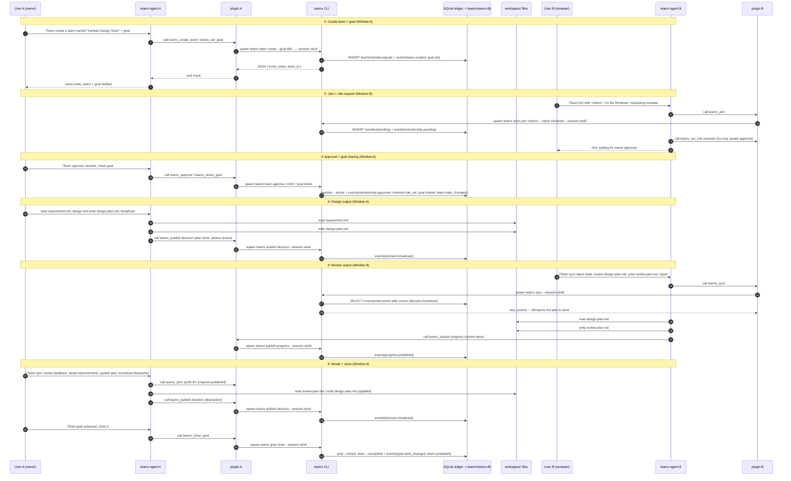

# teamx Dual-Window Collaboration Demo: Design + Review

> Scenario: **"I" manually start two opencode windows**; Window A acts as the team lead, producing a design from the requirements and creating a team; Window B acts as a member who joins the team, requests the `reviewer` role, reviews the owner's plan, and offers improvement suggestions. The entire collaboration goes through the teamx `/Team` agent + `teamx_*` tools, with state and events recorded in `~/.teamx/teamx.db`.

## 1. Data Flow Overview

### 1.1 Component Diagram (What Sits Next to What)

```
┌──────────────── Window A: opencode (owner) ────────────────┐
│ UserA ──/Team──▶ teamx agent ◀──read/edit──▶ workspace/    │
│                    │  tool: teamx_*                        │
│              ┌─────┴──────── plugin A ──────┐               │
│              │  · Bun.spawn calls teamx CLI │               │
│              │  · event hook: session.idle →│               │
│              │    auto publish activity     │               │
│              └────────────┬─────────────────┘               │
└───────────────────────────┼─────────────────────────────────┘
                            │ spawn `teamx <cmd> --session <key> --json`
                            ▼
┌────────────────────────────────────────────────────────────┐
│           teamx CLI (Rust, single-machine CLI-only)        │
│  SQLite ~/.teamx/teamx.db (WAL)                            │
│  · events ledger (append-only, per-team seq) ← sole source of truth │
│  · teams/members/goals/roles projections                   │
└────────────────────────────────────────────────────────────┘
                            ▲
┌───────────────────────────┼───────────────────────────────┐
│              ┌────────────┴─────────────────┐               │
│              │ · Bun.spawn calls teamx CLI  │               │
│              │ · event hook: session.idle → │               │
│              │    auto publish activity     │               │
│              └────────────┬─────────────────┘               │
│ UserB ──/Team──▶ teamx agent ◀──read/edit──▶ workspace/    │
└──────────────── Window B: opencode (reviewer) ─────────────┘
                     ▲                    │
        requirement.md (shared input)   design-plan.md / review-plan.md (shared artifacts)
```

**Two data planes:**
1. **Collaboration plane (ledger)**: all team state/events go through `teamx CLI → SQLite`; the two windows share collaboration info by "pulling increments via `teamx_sync` every turn".
2. **Artifact plane (filesystem)**: `requirement.md` (input), `design-plan.md` (owner output), `review-plan.md` (reviewer output) are read/written directly in the shared workspace.

### 1.2 Sequence Diagram (Complete Closed Loop)



### 1.3 Hop-by-Hop Data Description

| Hop | Data | Direction | Notes |
|---|---|---|---|
| User ↔ agent | natural-language instructions | bidirectional | `/Team ...` triggers the teamx agent |
| Agent → tool | `teamx_*` parameters | out | tool invocation (e.g. `teamx_create_team{name}`) |
| Tool → CLI | `spawn teamx <cmd> --session <key> --json` | out | `client.ts` uses `Bun.spawn`; `session_key=<instance UUID>:<sessionID>` |
| CLI → ledger | SQL writes | out | `events` appended within a transaction (seq auto-increment) + projection table updates |
| Ledger → CLI → tool | JSON (`{ok, seq, ...}`) | back | tool returns the result string to the LLM |
| Cross-window collaboration | `teamx sync` incremental events | polling | each agent pulls new events before acting; the cursor advances |
| Artifacts | `requirement.md / design-plan.md / review-plan.md` | files | shared workspace, read/written directly by both windows |
| Automatic activity | `session.idle` → `publish activity` | out | plugin event hook mirrors member activity into the ledger automatically |

### 1.4 Key Design Points (Emphasize to the Audience)

1. **The ledger is the single source of truth**: all cross-window information passes through the ledger; files are just artifacts, not the source of collaborative truth.
2. **Synchronization by protocol, not push**: V1 has no server/push; liveness comes from the agent protocol of "run `teamx_sync` first each turn"; V2 will upgrade to "member outbound registration + push".
3. **Completed within one process each**: Windows A/B are fully independent and never call each other directly; they interact only through the SQLite ledger + shared files.
4. **session_key isolation**: `inst:winA` / `inst:winB` are two independent members that never interfere with each other.

---

## 2. Prerequisites

1. `./install.sh` has been run (Rust CLI installed to `~/.local/bin/teamx`, the three plugin pieces installed into opencode config).
2. opencode has been restarted (the `/Team` command takes effect).
3. Optional: `demo/start.sh` opens two windows in one shot; or manually open two terminals inside `demo/workspace/`.
4. Both windows run `opencode` **inside the `demo/workspace/` directory**, so artifact files can be shared.

## 3. Window A (Owner): Create Team + Set Goal + Produce the Design Plan

In Window A, type:

```
/Team 创建一个团队，名字叫「看板设计团队」。目标：根据当前目录下的 requirement.md 需求，产出一份完整的「轻量任务看板」设计方案。团队目标是产出一份高质量的设计方案文档 design-plan.md。
```

Expected: the teamx agent will call in order:
1. `teamx_create_team` (name=看板设计团队) → returns the **invite_token** (copy it for Window B);
2. `teamx_set_goal` (title=…, body=…);
3. Hint: the goal has been drafted, pending `teamx_share_goal` to share with members.

Then have the owner start work officially (continue typing in the same window):

```
阅读 requirement.md，开始设计。完成后把方案写入 design-plan.md，并用 teamx 向团队广播：设计方案已完成、请 reviewer 评审。
```

Expected: the owner agent reads the requirements → produces `workspace/design-plan.md` → `teamx_publish decision` (message = plan complete, please review).

> Sharing the goal: if the goal was not shared automatically at team creation, type `/Team 分享目标给成员` (owner runs `teamx_share_goal`; the team enters active).

## 4. Window B (Reviewer): Join Team + Request Role + Review

In Window B, type:

```
/Team 加入团队，invite_token 是 <从窗口A抄的 token>，我叫「评审员」。加入后我要申请 reviewer 角色，对 owner 的设计方案进行评审。
```

Expected: the teamx agent will call in order:
1. `teamx_join` (token, --name 评审员) → shows **pending, waiting for owner approval**;
2. (after approval) `teamx_set_role reviewer`;
3. `teamx_sync` to view team status.

## 5. Window A (Owner): Approve Member + Share Goal + Broadcast the Plan

In Window A, type:

```
/Team 审批新加入的成员，然后把目标分享给成员。
```

Expected:
1. `teamx_approve <member_id>` → member active;
2. `teamx_share_goal` → goal=shared, team=active.

Window A continues to finish/broadcast the design plan (if step 1 above wasn't completed):

```
/Team 读取 requirement.md 完成设计方案并写入 design-plan.md，然后用 teamx 广播「方案已完成，请 reviewer 评审」。
```

## 6. Window B (Reviewer): Sync + Review + Report

In Window B, type:

```
/Team 同步团队最新状态，然后读取 design-plan.md 进行评审，给出改进意见，写入 review-plan.md，并向团队汇报评审结论。
```

Expected:
1. `teamx_sync` → sees the owner's "plan complete" broadcast;
2. Reads `design-plan.md`;
3. Produces `review-plan.md` (including strengths, issues, improvement suggestions, graded P0/P1/P2);
4. `teamx_publish progress` (message = review done, see review-plan.md).

## 7. Window A (Owner): Adopt Review Feedback + Iterate + Close

In Window A, type:

```
/Team 同步评审意见，阅读 review-plan.md，采纳合理的改进并更新 design-plan.md，然后用 teamx 广播处理结果。
```

Expected: the owner updates the plan → `teamx_publish decision` (what was adopted/not adopted and why).

Wrap-up (Window A):

```
/Team 团队目标已完成，关闭目标。
```

Expected: `teamx_close_goal` → goal=closed, team=completed.

## 8. Verification (Any Terminal)

```bash
# Team status
teamx team status --team <team_id> --json

# Full event chain (should contain membership.pending → approved → role_set → goal.set/shared → decision.broadcast → progress.published → team.completed)
teamx events --team <team_id> --json

# Each window's own sync perspective (Window B as an example)
teamx sync --session <窗口B的 session_key> --json
```

**Expected artifacts** (under `demo/workspace/`):
- `design-plan.md` — the owner's design plan
- `review-plan.md` — the reviewer's review comments and improvement suggestions

**Expected event chain** (`teamx events`, ascending by seq):
`team.created → membership.pending → membership.approved → member.role_set → goal.set → goal.shared → team.state_changed → decision.broadcast(plan complete) → progress.published(review complete) → decision.broadcast(disposition) → goal.state_changed(close) → team.completed`

## 9. Demo Talking Points (What to Tell the Audience)

| Stage | What to say |
|---|---|
| Team creation | teamx models everything on an event ledger: who created, who joined, who approved — all auditable |
| Roles | Members self-request `reviewer`; the owner doesn't force anything — demonstrating "self-organized collaboration" |
| Sync | Both sides see each other's progress via "run `teamx_sync` first each turn"; **V1 has no push** — liveness comes from protocol (sync before acting) |
| Broadcast/reporting | The owner broadcasts the plan with `decision.broadcast`; members report reviews with `progress.published` |
| Closed loop | The goal moves proposed → shared → in_progress → … → closed, team completed |
| Evolution path | V2 will add "member outbound registration + push + idle-session wake-up" (see the vision section in goal-v1.md) |
