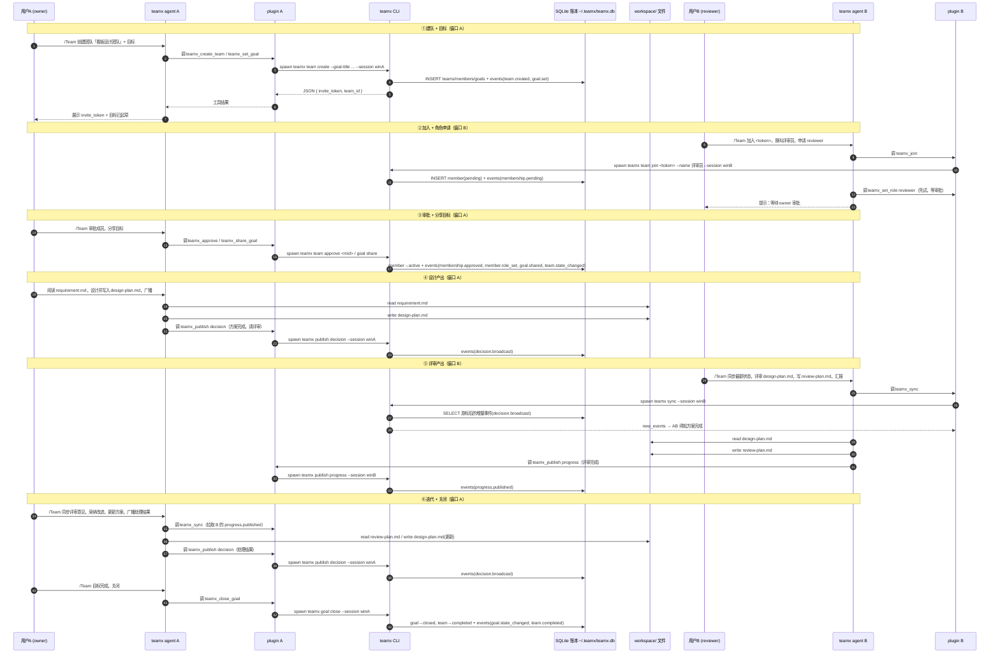

# teamx 双窗口协作 Demo：设计 + 评审

> 场景：**"我"手动启动两个 opencode 窗口**，窗口 A 作为 team owner 根据需求做设计并创建团队；窗口 B 作为 member 加入团队、申请 `reviewer` 角色，对 owner 的方案进行评审并提出改进意见。全程通过 teamx `/Team` agent + `teamx_*` 工具协作，状态与事件落在 `~/.teamx/teamx.db`。

## 1. 数据流总览

### 1.1 组件图（谁在谁边上）

```
┌──────────────── 窗口 A：opencode（owner）────────────────┐
│ 用户A ──/Team──▶ teamx agent ◀──read/edit──▶ workspace/   │
│                    │  tool: teamx_*                       │
│              ┌─────┴──────── plugin A ──────┐             │
│              │  · Bun.spawn 调 teamx CLI     │             │
│              │  · event hook: session.idle → │             │
│              │    自动 publish activity      │             │
│              └────────────┬─────────────────┘             │
└───────────────────────────┼───────────────────────────────┘
                            │ spawn `teamx <cmd> --session <key> --json`
                            ▼
┌────────────────────────────────────────────────────────────┐
│              teamx CLI（Rust，单机 CLI-only）                │
│  SQLite ~/.teamx/teamx.db（WAL）                            │
│  · events 账本（append-only，per-team seq）← 唯一权威事实源   │
│  · teams/members/goals/roles 投影                           │
└────────────────────────────────────────────────────────────┘
                            ▲
┌───────────────────────────┼───────────────────────────────┐
│              ┌────────────┴─────────────────┐               │
│              │ · Bun.spawn 调 teamx CLI     │               │
│              │ · event hook: session.idle → │               │
│              │    自动 publish activity      │               │
│              └────────────┬─────────────────┘               │
│ 用户B ──/Team──▶ teamx agent ◀──read/edit──▶ workspace/   │
└──────────────── 窗口 B：opencode（reviewer）────────────────┘
                     ▲                    │
        requirement.md（共享输入）   design-plan.md / review-plan.md（共享产物）
```

**两条数据平面：**
1. **协作平面（账本）**：一切 team 状态/事件经 `teamx CLI → SQLite`；两个窗口通过"每回合 `teamx_sync` 拉增量"共享协作信息。
2. **产物平面（文件系统）**：`requirement.md`（输入）、`design-plan.md`（owner 产出）、`review-plan.md`（reviewer 产出）在共享 workspace 中直接读写。

### 1.2 时序图（完整闭环）



### 1.3 逐跳数据说明

| 跳 | 数据 | 方向 | 说明 |
|---|---|---|---|
| 用户 ↔ agent | 自然语言指令 | 双向 | `/Team ...` 触发 teamx agent |
| agent → 工具 | `teamx_*` 参数 | 出 | 工具调用（如 `teamx_create_team{name}`） |
| 工具 → CLI | `spawn teamx <cmd> --session <key> --json` | 出 | `client.ts` 用 `Bun.spawn`；`session_key=<实例UUID>:<sessionID>` |
| CLI → 账本 | SQL 写 | 出 | 事务内 `events` 追加（seq 自增）+ 投影表更新 |
| 账本 → CLI → 工具 | JSON（`{ok, seq, ...}`） | 回 | 工具把结果字符串返回给 LLM |
| 窗口间协作 | `teamx sync` 增量事件 | 轮询 | 每个 agent 行动前拉新事件，游标推进 |
| 产物 | `requirement.md / design-plan.md / review-plan.md` | 文件 | 共享 workspace，双窗口直接读写 |
| 自动活动 | `session.idle` → `publish activity` | 出 | 插件 event hook 自动镜像成员活动到账本 |

### 1.4 关键设计点（对观众强调）

1. **账本是唯一权威**：所有跨窗口信息都过账本；文件只是产物，不是协作事实源。
2. **同步靠协议而非推送**：V1 无 server/推送，实时性来自"每回合先 `teamx_sync`"的 agent 协议；V2 将升级为"成员外连注册 + 推送"。
3. **同一进程内完成**：窗口 A/B 各自独立，互不直接调用；只通过 SQLite 账本 + 共享文件交互。
4. **session_key 隔离**：`inst:winA` / `inst:winB` 是两个独立 member，互不串扰。

---

## 2. 前置条件

1. 已执行 `./install.sh`（Rust CLI 装到 `~/.local/bin/teamx`，插件三件套已装到 opencode 配置）。
2. 已重启 opencode（`/Team` 命令生效）。
3. 可选：`demo/start.sh` 一键开两个窗口；或手动开两个终端进 `demo/workspace/`。
4. 两个窗口**都在 `demo/workspace/` 目录**运行 `opencode`，以便共享产出文件。

## 3. 窗口 A（owner）：创建团队 + 设置目标 + 产出设计方案

进入窗口 A，输入：

```
/Team 创建一个团队，名字叫「看板设计团队」。目标：根据当前目录下的 requirement.md 需求，产出一份完整的「轻量任务看板」设计方案。团队目标是产出一份高质量的设计方案文档 design-plan.md。
```

预期：teamx agent 会依次调用：
1. `teamx_create_team`（name=看板设计团队）→ 返回 **invite_token**（抄给窗口 B 用）；
2. `teamx_set_goal`（title=…，body=…）；
3. 提示：目标已起草，待 `teamx_share_goal` 分享给成员。

随后让 owner 正式开工（同窗口继续输入）：

```
阅读 requirement.md，开始设计。完成后把方案写入 design-plan.md，并用 teamx 向团队广播：设计方案已完成、请 reviewer 评审。
```

预期：owner agent 读取需求 → 产出 `workspace/design-plan.md` → `teamx_publish decision`（消息=方案完成，请评审）。

> 分享目标：如果创建团队时未自动分享，输入 `/Team 分享目标给成员`（owner 执行 `teamx_share_goal`，团队进入 active）。

## 4. 窗口 B（reviewer）：加入团队 + 申请角色 + 评审

进入窗口 B，输入：

```
/Team 加入团队，invite_token 是 <从窗口A抄的 token>，我叫「评审员」。加入后我要申请 reviewer 角色，对 owner 的设计方案进行评审。
```

预期：teamx agent 会依次调用：
1. `teamx_join`（token、--name 评审员）→ 提示 **pending，等待 owner 审批**；
2. （审批通过后）`teamx_set_role reviewer`；
3. `teamx_sync` 查看团队状态。

## 5. 窗口 A（owner）：审批成员 + 分享目标 + 广播方案

窗口 A 输入：

```
/Team 审批新加入的成员，然后把目标分享给成员。
```

预期：
1. `teamx_approve <member_id>` → 成员 active；
2. `teamx_share_goal` → goal=shared，team=active。

窗口 A 继续完成/广播设计方案（若第 1 步未完成）：

```
/Team 读取 requirement.md 完成设计方案并写入 design-plan.md，然后用 teamx 广播「方案已完成，请 reviewer 评审」。
```

## 6. 窗口 B（reviewer）：同步 + 评审 + 汇报

窗口 B 输入：

```
/Team 同步团队最新状态，然后读取 design-plan.md 进行评审，给出改进意见，写入 review-plan.md，并向团队汇报评审结论。
```

预期：
1. `teamx_sync` → 看到 owner 广播"方案已完成"；
2. 读取 `design-plan.md`；
3. 产出 `review-plan.md`（含：优点、问题、改进建议，按 P0/P1/P2 分级）；
4. `teamx_publish progress`（消息=评审完成，见 review-plan.md）。

## 7. 窗口 A（owner）：采纳评审 + 迭代 + 关闭

窗口 A 输入：

```
/Team 同步评审意见，阅读 review-plan.md，采纳合理的改进并更新 design-plan.md，然后用 teamx 广播处理结果。
```

预期：owner 更新方案 → `teamx_publish decision`（哪些采纳/不采纳及理由）。

收尾（窗口 A）：

```
/Team 团队目标已完成，关闭目标。
```

预期：`teamx_close_goal` → goal=closed，team=completed。

## 8. 验证（任意终端）

```bash
# 团队状态
teamx team status --team <team_id> --json

# 完整事件链（应含 membership.pending → approved → role_set → goal.set/shared → decision.broadcast → progress.published → team.completed）
teamx events --team <team_id> --json

# 两个窗口各自的 sync 视角（以窗口 B 为例）
teamx sync --session <窗口B的 session_key> --json
```

**预期产物**（`demo/workspace/` 下）：
- `design-plan.md` —— owner 的设计方案
- `review-plan.md` —— reviewer 的评审意见与改进建议

**预期事件链**（`teamx events` 按 seq 递增）：
`team.created → membership.pending → membership.approved → member.role_set → goal.set → goal.shared → team.state_changed → decision.broadcast(方案完成) → progress.published(评审完成) → decision.broadcast(处理结果) → goal.state_changed(close) → team.completed`

## 9. 演示讲解要点（对观众讲什么）

| 环节 | 讲什么 |
|---|---|
| 建队 | teamx 用事件账本建模：谁创建、谁加入、谁审批都可审计 |
| 角色 | 成员自主申请 `reviewer`，owner 无强制，体现"自主协作" |
| 同步 | 双方靠"每回合先 `teamx_sync`"看到对方进展；**V1 无推送**，实时性来自协议（行动前同步） |
| 广播/汇报 | owner 用 `decision.broadcast` 广播方案；member 用 `progress.published` 汇报评审 |
| 闭环 | 目标从 proposed → shared → in_progress → … → closed，team completed |
| 演进方向 | V2 将加"成员外连注册 + 推送 + 闲置会话唤醒"（见 goal-v1.md 构想节） |
